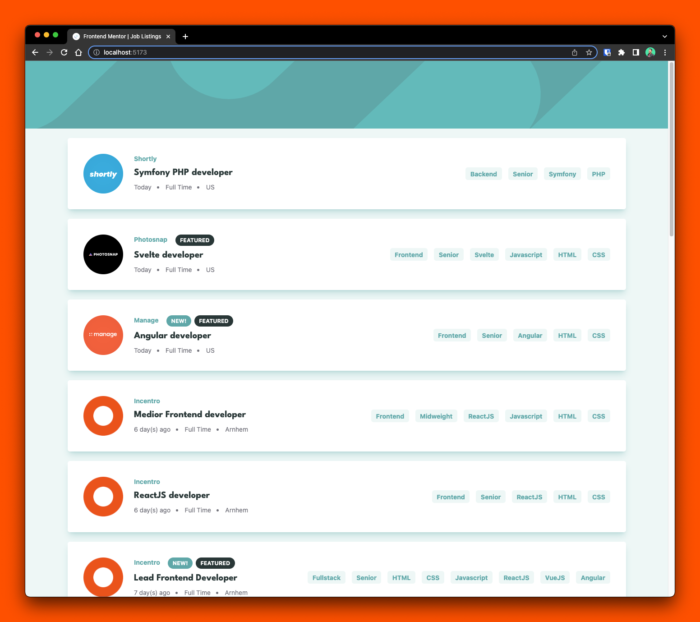
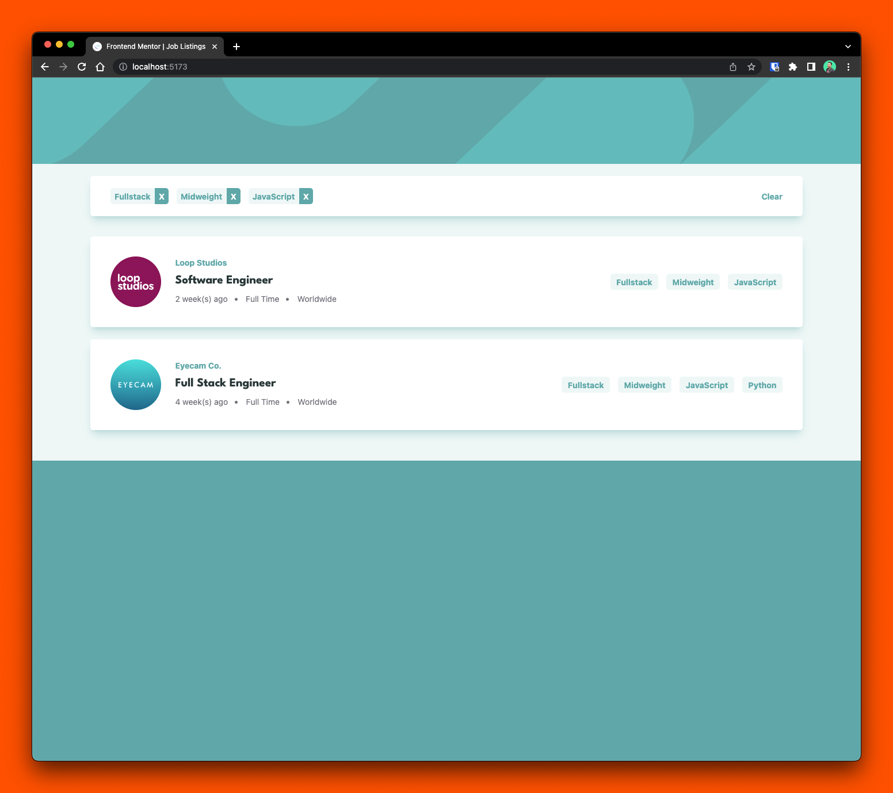
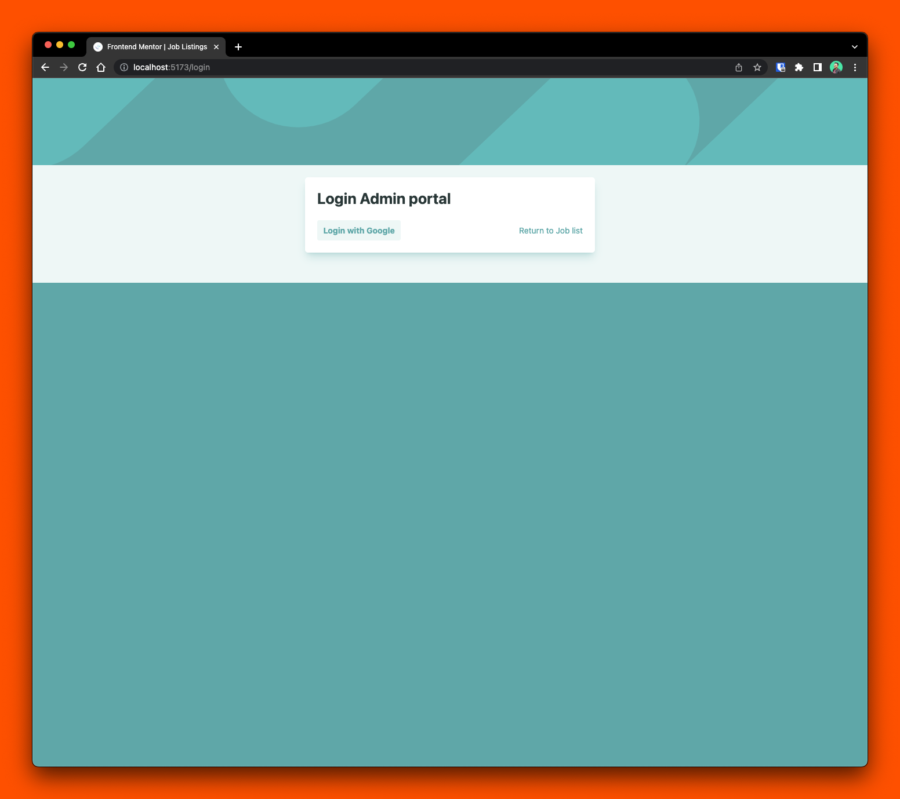
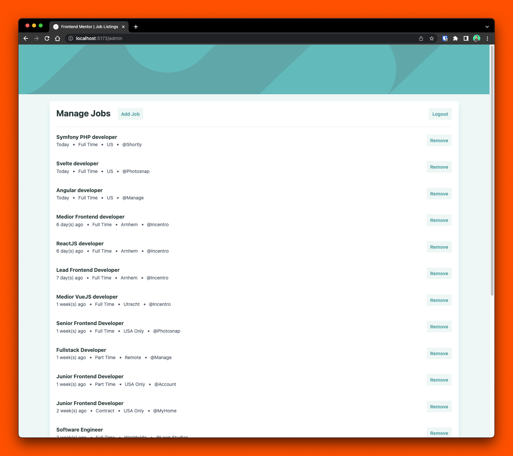
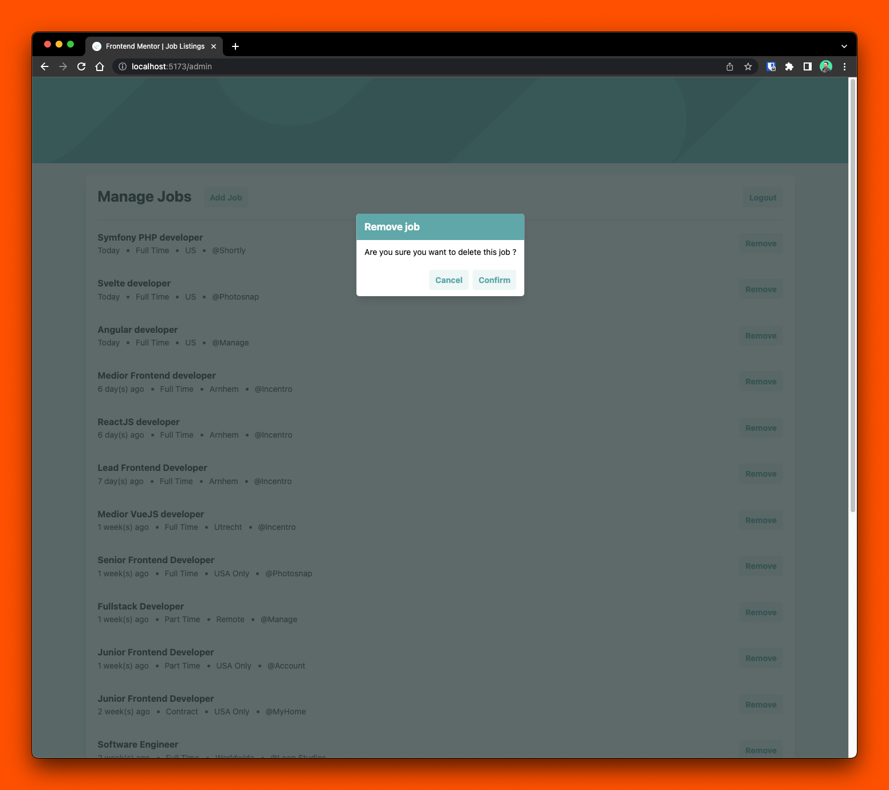
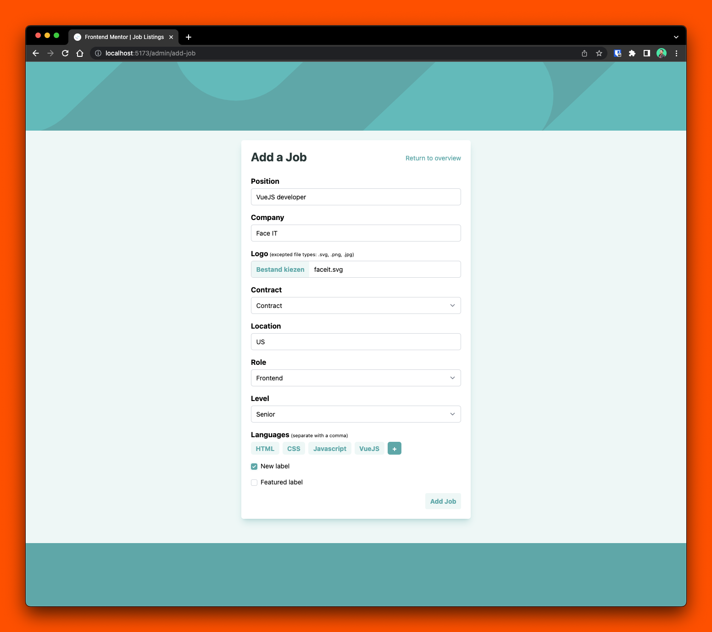

# Frontend Mentor - Job listings with filtering solution

This is a solution to the [Job listings with filtering challenge on Frontend Mentor](https://www.frontendmentor.io/challenges/job-listings-with-filtering-ivstIPCt). Frontend Mentor challenges help you improve your coding skills by building realistic projects. 

## Table of contents

- [Overview](#overview)
  - [The challenge](#the-challenge)
  - [Screenshot](#screenshot)
  - [Links](#links)
- [My process](#my-process)
  - [Built with](#built-with)
  - [What I learned](#what-i-learned)
- [Author](#author)
- [Acknowledgments](#acknowledgments)

## Overview

### The challenge

Users should be able to:

- [x] View the optimal layout for the site depending on their device's screen size
- [x] See hover states for all interactive elements on the page
- [x] Filter job listings based on the categories

#### Additional challenge

- [x] Use VueJS (utilizing both Option API and Composition API)
- [x] Persist and fetch data from external source (Firebase Realtime Database)
- [x] Add Admin route where jobs can be added and removed
- [x] Admin route is protected by authentication
- [x] Google OAuth
- [ ] Use tRPC to fetch data from Firebase

### Screenshot

### Links

## My process

### Built with

- Semantic HTML5 markup
- Tailwind CSS
- VueJS

### What I learned

- Create Web application with VueJS (both Option API and Composition API)
- Utilize Tailwind CSS for styling
- Use Firebase for persist data

## Author

- Website - [Andrew Reasoa](https://www.andrewreasoa.com)
- Frontend Mentor - [@yourusername](https://www.frontendmentor.io/profile/drw026)

## Acknowledgments
Maximilian Schwarzmüller, for his excellent [VueJS course](https://www.udemy.com/course/vuejs-2-the-complete-guide) on Udemy.
